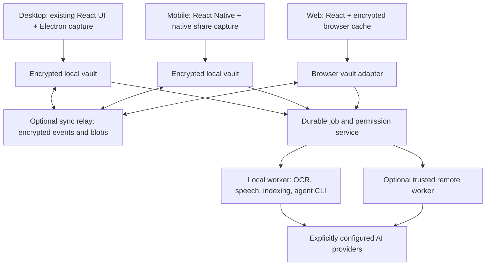

# AIOS: from personal desktop app to a shipping multi-device product

Decision proposal, 2026-09-18. This document defines the target and delivery sequence; it does not claim that the proposed encryption, sync, mobile, or cloud features exist today.

## Start here

Execution update, 2026-09-19: three desktop hardening batches now exist. Read [current status](SHIP-STATUS.md) and [the v1.4 agent handoff](SHIP-HANDOFF.md) before assigning work. The immediate tasks are installer/UI/ingest verification; this architecture remains the target, not shipped encryption/sync.

AIOS should become an encrypted personal knowledge vault with excellent capture and optional agent execution. Keep its current look and the brain/neuron experience. Make reliable capture, retrieval, and portability the product's foundation; connect powerful agents through explicit, configurable adapters.

The recommendation is to retain Electron/React for desktop and React Native/Expo for mobile, extract a shared TypeScript core, add encrypted local storage on every native device, and synchronize encrypted records and attachments through an optional relay. Processing and agent execution belong in separately trusted workers. A cloud sync server should not need the keys to read a user's brain.

Use these four documents as one execution package:

| Document | Purpose |
|---|---|
| [Shipping assessment](SHIP-AUDIT.md) | Code evidence, verified checks, and release blockers |
| This plan | Product behavior, architecture, security, migration, and sequencing |
| [Executable backlog](SHIP-BACKLOG.md) | Bounded work packets, dependencies, deliverables, and acceptance evidence |
| [Launch and business plan](SHIP-LAUNCH.md) | Accounts, distribution, beta, pricing experiments, launch, and operations |

Interpretation: “second ray” means Second Brain. “Grok-Bot-like” means direct conversations with named bots, visible status, and easy handoff to other agents. No dependence on an unidentified third-party UI or a visual redesign is proposed.

## The experience to ship

1. Install AIOS, create or recover a vault, and save the first capture without creating an AIOS account or entering an AI API key.
2. On desktop, snip with the existing shortcut or import text, links, images, PDFs, audio, and video. On mobile, take a screenshot and choose **Share → AIOS → Save to Brain**. Save original bytes before invoking AI.
3. Immediately see the item in an Inbox within Second Brain. Processing fills in OCR, transcript, chapters, links, entities, summaries, and related neurons. An unavailable provider leaves a saved, retryable item.
4. Open a neuron and inspect its original source, timestamped transcript, video frames, extracted text, metadata, research, and history. Every generated statement can be distinguished from captured evidence.
5. Enable sync optionally, pair a second device, and access the same vault. Small records and previews sync first; full videos can be downloaded on demand or pinned offline.
6. Add Hermes, Claude, Codex, Grok, Gemini/Google agents, OpenClaw, or a local model in Settings. Choose which connections appear as tabs. Each tab uses the same conversation shell, with only supported actions enabled.
7. Turn a neuron or chat request into an Orchestra task. See which host will execute it, what context it receives, its cost limit, tool permissions, progress, and approval requests.
8. Export a versioned JSON-based archive, restore it elsewhere, switch sync servers, revoke a device, or delete the vault without requiring continued payment.

“Works across devices” means a common vault and coherent workflows. It does not mean iOS can execute desktop CLIs or that a browser can capture another app's screen without OS/browser permission. Mobile shares and background work must respect platform lifecycle limits. [Apple share extensions](https://developer.apple.com/library/archive/documentation/General/Conceptual/ExtensibilityPG/Share.html), [Android share receiving](https://developer.android.com/develop/ui/compose/sharing/receive).

## Product modes and honest privacy boundaries

| Mode | Data location and keys | External account requirement | Behavior with desktop off |
|---|---|---|---|
| Local only | Encrypted vault on each device; user owns keys | None for capture, local OCR/search, and installed local models | That device remains useful; no automatic cross-device delivery |
| Personal sync host | Same encrypted replicas plus a relay on the user's PC/NAS/VPS | No third-party service account for a LAN host; a rented VPS has its own account | Works if another relay is online; otherwise devices queue changes |
| Managed AIOS Sync | Clients decrypt; hosted relay stores ciphertext and routing metadata | One AIOS service identity; optional billing | Devices sync without a desktop; local/remote AI availability remains separate |
| Optional trusted runner | User's desktop or isolated server receives explicitly permitted content | Provider account only for external AI; cloud hosting if rented | Heavy processing continues if that runner is online and authorized |
| Web access | Browser decrypts authorized records after unlock | Determined by chosen relay; no separate AI provider account just to browse | Available against relay, with a limited encrypted browser cache |

A relay and a runner are different trust roles even when deployed on one machine. Cloud OCR or a cloud agent necessarily receives plaintext for its assigned inputs. Do not describe that processing as invisible to the processor. Explain the destination before enabling it and minimize transmitted context.

A local runner pauses when the vault locks by default. An optional “continue selected jobs while locked” policy must explain that the running job retains decryption capability for its approved inputs. Device revocation cannot erase content that a previously authorized device already decrypted.

The 1Password analogy is a product and security goal: encrypted replicas, deliberate enrollment, clear recovery, and consistent UX. It is not evidence of equivalent implementation or independent assurance. [1Password's documented security model](https://support.1password.com/1password-security/).

## Architecture



The diagram shows logical boundaries, not mandatory separate servers. Ship a desktop bundle containing its local services. Package the relay independently. Do not require Kubernetes, a vector database server, Redis, Firebase, or Docker for ordinary desktop use.

### Keep and extract incrementally

Retain `src/ui`, `BrainView3D`, the snippet editor, DeepDive components, terminal components, and Orchestra's board presentation. Replace direct persistence and provider calls behind interfaces before moving folders. `src/lib/db.ts` is already a useful seam.

Target layout after incremental extraction:

```text
apps/desktop/                 Electron main/preload + current React app
apps/mobile/                  current Expo app + native capture extensions
apps/web/                     shared web UI with browser transport/storage
services/relay/               device authorization, encrypted events/blobs
services/runner/              headless job execution and agent adapters
packages/domain/              versioned records and validation
packages/vault/               repositories, encryption/key lifecycle interfaces
packages/sync/                outbox/inbox, merge rules, protocol schemas
packages/jobs/                durable state transitions and scheduling
packages/providers/           model and agent capability adapters
packages/brain/               source graph, retrieval, derived relationships
packages/ui/                  existing desktop/web design primitives
```

Begin with npm workspaces and the existing lockfile tooling. Share schemas, policy, protocol, and business logic between native and web; use platform storage/capture implementations. Do not force React Native to render all desktop components.

### Alternatives and scope decisions

| Alternative | Decision and reason |
|---|---|
| Rewrite Electron in another desktop framework | Defer; it does not solve replication, mobile lifecycle, or key management, and discards working UI/PTY integration |
| Sync the SQLite file through a cloud drive | Reject for active replicas; concurrent database/WAL copies do not provide record conflicts or reliable deletion |
| Plaintext hosted database as the source of truth | Reject for the proposed privacy promise; it requires the service to see the brain and makes offline behavior harder |
| Full collaborative CRDT editor everywhere | Defer; single-user multi-device editing can preserve conflicting revisions without a new collaborative document engine |
| Existing replication framework | Evaluate during B16; reuse maintained transport/merge components if they pass the ciphertext, offline, deletion, and portability requirements. Do not assume ordinary row replication provides end-to-end encryption |
| Direct peer-to-peer mesh as the only sync | Defer; availability and NAT traversal increase support burden. A small optional relay gives a clearer first product |

The proposed sync protocol is intentionally limited to versioned records, blobs, and preserved conflicts. Reuse established cryptographic and transport implementations; the unavoidable application-specific parts are the data model, authorization rules, recovery, and user-visible conflict behavior.

### Storage decisions

Use SQLCipher-backed SQLite for native local vaults, with encrypted attachment files outside the database. Stock `better-sqlite3` does not become encrypted merely by adding a key pragma; prove a maintained SQLCipher build/binding on each shipping architecture before committing to it. Expo's current SQLite documentation supports SQLCipher in native builds, including iOS and Android, but not Expo Go. Validate the selected Expo version and native extensions together. [SQLCipher](https://www.zetetic.net/sqlcipher/), [Expo SQLite](https://docs.expo.dev/versions/latest/sdk/sqlite/).

Time-box the desktop/mobile encryption compatibility spike to 1–2 engineer-weeks. If native binding support fails, compare a maintained native vault service with encrypted-record storage plus rebuilt in-memory indexes. Do not fall back to a plaintext database or delay encryption until after sync.

Browser storage uses encrypted IndexedDB/OPFS records and blobs through the same repository contract. SQLCipher native support does not imply browser support. Decrypt only in an unlocked session; keep derived search indexes in memory initially or persist them encrypted. Explain that a compromised website deployment can run code in the unlocked browser; signed native clients offer a different update trust boundary.

Relay storage: PostgreSQL for identities, device grants, opaque change envelopes/cursors, quotas, and blob references; an S3-compatible store or local filesystem for encrypted blobs. Offer one documented Docker Compose deployment with local volumes and HTTPS termination. Managed hosting can reuse the same protocol and schema. PostgreSQL contains no plaintext brain content or provider credentials.

### Domain model

| Record | Key fields and invariants |
|---|---|
| Vault / device | Stable random IDs, key epoch, public device keys, grants, protocol version |
| Capture | ID, source type, captured time, source URL/app, original blob references, processing state |
| Blob | Random opaque ID, encrypted size, media type within encrypted manifest, integrity metadata, encryption format version |
| Extraction | Capture ID, processor/model version, language, OCR blocks/bounding boxes, transcript segments and timestamps |
| Neuron | Title, user notes, typed entities, tags, linked captures and research; independently revisioned user edits |
| Relationship | Source/target, relation type, evidence reference, confidence, user-confirmed flag |
| Conversation / message | Append-only message IDs, parent/branch IDs, attachments, context references, provider session mapping |
| Agent / connection | Adapter ID, display name, capability set, runner binding, model choice, secret reference, permission policy |
| Task / run / event | Task dependencies, attempt ID, runner ID, lease/fence, event sequence, approvals, budget, artifacts |
| Mutation / tombstone | Object ID, mutation ID, author device, parent revision, protocol/key epoch, deletion state |

Keep original evidence immutable. A corrected OCR block is a new extraction revision; a generated summary does not overwrite user notes. Store large media as encrypted files, not base64 JSON columns. Machine paths, local window state, CLI login caches, and host permissions stay device-local; sync a portable connection template with “configure on this device” status.

## Encryption and recovery specification

Adopt established cryptographic libraries and have the composition independently reviewed. Do not invent a cipher or claim that choosing AES alone solves the vault protocol.

The design proposal is a randomly generated vault root key, independently generated per-blob data keys, a separate local database key, and separate signing/encryption identities per device. Wrap keys for authorized devices and for a user-held recovery secret. For password unlock, use a reviewed password KDF such as Argon2id with device-calibrated parameters; record algorithm/parameter versions. OS secure storage wraps device secrets; biometrics authorize local access rather than replace recovery.

Encrypt records and chunked media with a reviewed authenticated-encryption construction. Bind vault/object IDs, revision, key epoch, and chunk ordering in authenticated metadata; specify nonce generation, size limits, error behavior, and cross-platform test vectors. Encrypt thumbnails, transcripts, embeddings, derived indexes, task output, and backups as well as originals. Never expose plaintext content hashes to a shared relay for cross-user deduplication.

Passkeys or another account login can authenticate a managed-service user. Vault decryption is a separate lifecycle: an account password reset must not silently give the service the vault key. Recovery requires another authorized device or the recovery secret. If all are lost, support cannot recover the content. Test that flow before onboarding promises are written.

Pairing uses a short-lived, one-use invitation and authenticated public-key exchange, with QR/manual fingerprint confirmation from an existing unlocked device. A base64 bundle containing a long-lived bearer token is not acceptable. A new device receives only the keys and permissions the user approves. Terminal execution is a separate grant from vault membership.

Device removal revokes transport credentials, rejects future stale-epoch writes, and rotates access to future encrypted revisions. Define rewrapping/re-encryption policy for retained history, and explicitly document that prior downloads remain outside remote erasure guarantees. Keep password recovery, lost device recovery, device revocation, vault restore, and service account deletion as separate tested workflows.

At lock: close native database handles, stop unauthorized jobs, clear UI content and decrypted caches as far as the platform permits, revoke renderer session capabilities, redact app-switcher previews, and avoid content in notifications. Do not promise complete RAM erasure from JavaScript runtimes. Temporary processing files need restrictive access, bounded lifetimes, crash cleanup, and a documented deletion limitation for SSDs/backups.

## Synchronization specification

Synchronize versioned logical records and encrypted blobs, never the live SQLite database/WAL files through a shared drive. Version one is a single-user vault replicated across devices; multi-user collaborative editing is a later product.

1. A local transaction persists a content revision, a unique mutation ID, and an outbox entry before the UI says saved. Media commits atomically through staged files and a manifest.
2. The sync client checks protocol compatibility and membership epoch, then uploads authenticated encrypted envelopes in bounded batches. Upload blobs in resumable chunks and finalize verified manifests.
3. The relay authorizes vault/device membership and quota, deduplicates mutation IDs, and acknowledges durable storage with a cursor. Push hints contain no content and are optional; foreground polling can recover every change.
4. Each device downloads after its last durable cursor, verifies authorship and encryption, applies changes transactionally, and rebuilds derived indexes. Download acknowledgments are distinct from upload acknowledgments and from processing completion.
5. A compaction/checkpoint scheme preserves authorized device progress and deletion history. A device older than the retained history window must reseed from a verified snapshot while preserving its unsent outbox for explicit reconciliation.

Proposed transport surface: version/capabilities, enrollment, device list/revocation, mutation push, cursor pull, encrypted snapshot retrieval, blob upload/finalize/download, and deletion status. Specify schemas, maximum sizes, idempotency, error codes, protocol upgrades, and conformance fixtures before writing two clients.

Merge rules are product behavior:

| Data | Conflict policy |
|---|---|
| Captures, chat messages, completed run events | Immutable unique records; deduplicate identical mutation IDs |
| User notes / transcript corrections | Compare causal parent revisions; preserve both conflicting edits with a resolve UI |
| Tags | Explicit add/remove operations with deterministic observed-remove semantics |
| Cosmetic preferences | Deterministic last-write policy with logical clocks and device tie-breaker; never apply blindly to notes |
| Generated summaries / embeddings | Version by source hash and processor; superseded results cannot overwrite a newer source revision |
| Deletion | Tombstone dominates older updates; explicit restore creates a new revision; an offline edit becomes a recoverable conflict, not resurrection |
| Tasks and runs | One execution owner/lease, not arbitrary last-write merge; UI replicas submit commands with expected revisions |

Clock skew must not determine whose note is lost. The relay sequences delivery, while parent revisions establish causality. Signature verification alone cannot prove a malicious relay has shown a fresh, complete history: persist high-water marks, sign snapshots/membership changes, reject known rollback, and document residual withholding/fork risks for independent review.

Revoked or stale devices must refresh authorization before submitting old queued work. Never silently discard their local outbox. Blob garbage collection runs only after retention and deletion rules make references unreachable. Failed or partial attachment uploads must not become valid complete captures.

Default sync policy: records and lightweight previews automatically; original large media over Wi-Fi or user choice. Show **saved on device**, **synced**, **processing on [device]**, **waiting for worker**, and **conflict** separately. Background delivery on mobile is best-effort; foreground reconciliation is mandatory and deterministic.

## Capture, video, and research

The processing pipeline is a durable dependency graph:

```text
capture and validate -> encrypt/store original -> saved receipt
    -> image/PDF OCR ------------------------------+
    -> audio extraction -> timed transcript --------+-> organize -> index -> neuron
    -> scene sampling -> frame OCR ----------------+
    -> optional research with cited evidence ------+-> linked research revision
```

Each stage records input fingerprint, processor version, output references, progress, attempt count, next retry, cancellation, and a bounded cost/time budget. Use at-least-once scheduling with idempotent effects; do not promise exactly-once execution of arbitrary external tools. A worker crash should resume from verified outputs rather than repeat an entire video.

Desktop capture keeps the existing shortcut/overlay where supported. Add clipboard paste, drag/drop, file picker, URL capture, and an optional browser extension later. Implement macOS capture permission guidance and Linux portal-aware capture; test Windows mixed-DPI/multi-monitor behavior. A Hyprland-specific helper can be an optional backend, not the universal Linux solution.

Mobile shares must first copy granted content into app-owned encrypted staging before temporary URI permissions expire. Build a native Android receive activity and iOS share extension through supported Expo prebuild/native modules. Keep the extension small; defer OCR/video decoding and network work. If the vault is locked, either request unlock or store a reviewed sealed capture encrypted to an ingestion public key; never keep a plaintext draft to make sharing convenient. Native secure storage should hold small secrets, not media. [Expo SecureStore](https://docs.expo.dev/versions/latest/sdk/securestore/).

For offline defaults, evaluate bundled Tesseract on desktop and platform-native/on-device OCR on mobile; use local embeddings with downloadable, checksummed models. Offer whisper.cpp as a local transcription worker with hardware-specific profiles. Treat model downloads, language support, licensing, CPU/RAM needs, and first-run size as explicit product choices. A small capture/OCR install should not require downloading several gigabytes before saving anything. [Tesseract](https://tesseract-ocr.github.io/tessdoc/), [ML Kit text recognition](https://developers.google.com/ml-kit/vision/text-recognition/v2), [whisper.cpp](https://github.com/ggml-org/whisper.cpp).

Video v1 accepts user-selected local files and authorized sources. Extract metadata and audio; produce timestamped speech segments; sample frames on scene changes plus a configurable periodic interval; remove near-duplicates; OCR frames; merge repeated observations with time ranges. For a 60-minute recording, start with a configurable periodic cap rather than processing every frame, and give users a denser rerun option. Scene sampling can miss brief text; present coverage and offer manual frame capture. Never claim to extract every visible fact from a video.

Keep literal OCR separate from inferred entities and summaries. For links, preserve the exact observed text, frame/time/bounding box, corrected candidate if any, confidence, and verification result. Do not automatically browse every OCR link. Preserve names as observed and label entity resolution suggestions. Use deterministic parsers before model enrichment where possible.

FFmpeg runs as an isolated, resource-limited child process with argument arrays, timeouts, bounded output, and controlled temp paths. Review the exact codec/build distribution and its obligations before bundling. [FFmpeg distribution considerations](https://ffmpeg.org/legal.html).

The neuron detail panel should offer **Overview / Original / Transcript / Frames / Sources / Activity**, reusing current typography, cards, colors, and editor patterns. Timestamp selection seeks to the corresponding frame/audio; source citations open a precise evidence span. One video appears as a parent neuron with optional expandable evidence children, preventing graph overload.

Deep research operates on an explicit selection of evidence, formulates bounded questions, retrieves current sources, and stores URL, title, retrieval date, available publication date, supporting excerpts, and claim-to-source mappings. Distinguish a live link from a verified claim. Show unresolved conflicts and unsupported conclusions. Restrict external fetching through the safe broker; treat documents and web text as untrusted content, never instructions granting agent privileges. Local-only mode offers retrieval over saved material, with online research explicitly unavailable until enabled.

Search combines local full-text retrieval with optional semantic ranking. Record embedding provider, model, dimension, and version; equal dimensions do not imply comparable vector spaces. Keep search indexes inside the encryption boundary. Compute relationships incrementally in a worker and render bounded neighborhoods; the graph is a view of the knowledge model, not its authoritative database.

## Agents, tabs, and Orchestra

Separate a **model provider** (chat, vision, embedding, speech, search) from an **agent runtime** (sessions, tools, approvals, files, subprocesses). A provider logo must not imply all capabilities.

Define a connection manifest with adapter/version, display name/icon, configured runtime or URL, auth mode, local secret reference, device/runner mapping, capabilities, privacy policy, budgets, health checks, and visibility/order. Allow several differently named connections to the same provider. Do not execute arbitrary JavaScript from imported manifests. Custom terminal launchers remain user-approved local configuration and are not silently activated by sync/import.

Settings becomes **Vault & Sync / Devices / Connections / Capture & Processing / Privacy / Data & Backups / Appearance** while retaining the current styling. Provide a wizard: discover installed agents, show versions, select supported login method, test connection, choose permitted context/tools, pin a tab. Local AIOS must remain usable if discovery finds no agent.

For missing runtimes, offer “Connect an existing host,” “Use provider API,” or a separately qualified installation helper. Any bundled/downloaded runtime must have verified provenance, version pinning, platform compatibility, and distribution rights. Installation is explicit and cancellable; do not require users to paste arbitrary shell-install scripts or install a development toolchain to use ordinary AIOS features.

### Provider implementation direction

| Connection | Recommended integration and qualification |
|---|---|
| Claude | Official Agent SDK in the trusted runner; persistent sessions, permission callbacks, hooks, budget limits, controlled subagents. API-key authentication is the baseline embedded-product route; subscription integration requires the approval identified in the audit |
| Codex | Preserve and modernize the SDK adapter for jobs; persist and resume native thread IDs. Keep actual coding permissions distinct from the current read-only chat route |
| Codex richer client | Evaluate app-server behind a versioned preview adapter for native account/session/approval UX. The fetched documentation marks the app-server command/WebSocket transport experimental and unsupported for production; do not make it a mandatory GA or public-network dependency |
| Hermes | Negotiate advertised capabilities and use structured session/run/approval protocols when available; retain chat compatibility with older hosts. Keep cron actions version-specific rather than assuming every gateway implements today's routes |
| OpenClaw | Gateway protocol adapter with negotiated version, device identity, operator scopes, session events, and explicit approvals; do not treat its management API as an unrestricted model endpoint |
| Grok | Supported xAI API/tool integration first. Detect and separately qualify an installed CLI before enabling a terminal or structured runtime adapter; no assumed subscription/API equivalence |
| Google / Gemini | Preserve the current Antigravity path as a named adapter, probe version/capabilities, and use structured output where supported. Keep Gemini API and any compatible Gemini CLI connection distinct |
| Local models | An explicit local endpoint adapter such as Ollama for supported chat/embedding capabilities, with device-local host mapping and model installation checks |

These choices follow current primary sources: [Claude sessions](https://code.claude.com/docs/en/agent-sdk/sessions), [Claude subagents](https://code.claude.com/docs/en/agent-sdk/subagents), [Codex SDK](https://learn.chatgpt.com/docs/codex-sdk), [Codex app-server](https://learn.chatgpt.com/docs/app-server), [Hermes integration](https://hermes-agent.nousresearch.com/docs/developer-guide/programmatic-integration/), [OpenClaw protocol](https://docs.openclaw.ai/gateway/protocol), [xAI tools](https://docs.x.ai/developers/tools/overview), and [Ollama API](https://docs.ollama.com/api/introduction). Recheck documentation and pinned runtime compatibility during implementation rather than freezing today's model names.

One specific modernization is already supported by documentation: current Antigravity headless mode exposes streaming JSON, conversation IDs/resume, and streamed stdin. The current AIOS comment describing text-only output is outdated for those documented versions. Gate the richer behavior by detected version and remove blanket permission skipping. [Antigravity headless documentation](https://antigravity.google/docs/cli/headless/).

### Direct bot chat

Add a reusable Agent Conversation view within existing tabs and the Orchestra drawer: bot identity, provider/model, execution host, persistent sessions, attachments from the brain, tool activity, approvals, artifacts, usage, and stop/retry. A handoff creates a linked conversation with a visible context bundle. It never silently exports the whole vault or carries provider-private session files to another machine.

User-added tabs can expose **Chat / Tasks / Activity / Terminal** according to capabilities. On phones, Terminal controls an explicitly authorized remote runner. Unsupported features stay disabled with an explanation; a disconnected runtime does not hide the user's saved conversations.

### Durable orchestration

Move Maestro's deterministic policy out of React and keep the board as its client. Use persistent tasks, run attempts, events, dependencies, approvals, budgets, and heartbeat leases. A task selects a compatible runtime and host. Each run has a monotonic event sequence; reconnecting clients replay events without replaying execution.

States: `queued → waiting_for_worker → running → waiting_for_approval → reviewing → succeeded`, with `paused`, `failed`, `canceled`, and `interrupted` outcomes. Preserve provider-specific detail alongside normalized events. A network disconnect is not success, and a stale lease is not permission to repeat a destructive external action.

An offline desktop may execute its own explicitly local tasks. Cross-device/cloud commands require the authoritative execution service to accept and fence the run. Partitioned clients can queue requests, but must not start duplicate side-effecting runs independently. Worktree isolation, scoped filesystem roots, network policies, process limits, and credential injection apply per job. Human approval or a preauthorized policy governs publishing, deployment, destructive actions, and new destinations.

For code tasks, store changed files, diff, test commands/results, artifacts, and the worker's summary. A reviewer checks this evidence against acceptance criteria. Budget for independent review; two agents agreeing with each other is not a substitute for executable checks.

Runtime persistence is part of the privacy boundary: SDKs/CLIs may keep their own transcripts, checkpoints, caches, and logs outside AIOS's database. Use supported isolated data directories and protect them through encrypted storage or a reviewed temporary-materialization lifecycle with crash cleanup. Do not move or erase an existing user's shared CLI home. Where a runtime cannot meet the intended storage guarantee, disclose that boundary and restrict the feature instead of implying SQLCipher protects those external files. Native resume stays bound to its compatible runtime/host; portable conversation history remains readable everywhere without promising that an in-flight process can move machines.

## Export, import, deletion, and migration

Keep a straightforward JSON export for small, textual vaults. Add a portable archive containing a versioned `manifest.json`, JSON/NDJSON records, attachments, checksums, and processing/model metadata. Default to an encrypted archive; offer a deliberate plaintext export with a concise warning. API keys and CLI tokens are excluded by default. Provider caches and external agent transcript directories require a separate inventory and cleanup policy; AIOS cannot assume ownership of a user's shared CLI home.

Import into a staging vault; validate format/version, sizes, references, attachment paths, checksums, and schemas; preview counts/conflicts; then commit transactionally. Restore uses a new device identity and does not reinstate old bearer tokens, runner leases, enabled automations, or trusted machine paths. Support merge, duplicate-as-new, and explicitly confirmed replacement. Test export from one OS and restore on another with original bytes and relationships intact.

Existing-user migration: inventory SQLite, WAL/SHM, IndexedDB, exports, media, and configuration; create a recoverable backup; convert into a new encrypted vault; verify counts/checksums and sample retrieval; switch atomically; keep an explicit rollback path. Explain which legacy plaintext copies remain and offer their removal after validation. Never report a vault encrypted while silently retaining an active plaintext database. Secure deletion of SSD history or external backups cannot be guaranteed.

Deletion propagates tombstones, removes accessible originals and derived records, schedules encrypted blob garbage collection, and documents backup expiry. Separate “remove from this device,” “delete everywhere,” “delete hosted account,” and “remove local application.” Stopping a subscription must not prevent export or local access.

## Delivery sequence and exit gates

| Phase | Outcome | Primary backlog | Exit evidence |
|---|---|---|---|
| 0: contain and measure | Safe development baseline and bounded privilege | B01–B06 | Rejected unauthorized requests, enforced tool policies, advisory triage, CI checks |
| 1: dependable local vault | Encryption, recovery, durable capture, offline usefulness, media pipeline | B07–B15 | Offline capture survives crash; keys/recovery tested; video evidence works; export restores |
| 2: actual multi-device product | Encrypted sync, pairing, independent mobile capture, deletion | B16–B22 | Three-device offline/concurrent-edit/revocation/restore matrix passes |
| 3: coherent agent workspace | Connection registry, durable runs, direct bot tabs | B23–B28 | Supported adapters pass common contract tests and permission tests |
| 4: release engineering | Onboarding, web/self-host, signed builds, updates, mobile stores | B29–B35 | Clean-machine installs, protocol upgrades, restore drills, external security review |
| 5: market release | Qualified beta, pricing, release candidate, distribution and support | B36–B39 | Written GA signoff against the release gates |
| 6: expansion | Improved retention and sustainable paid service | B40 | Measured demand and service economics justify added scope |

These are dependency stages, not a ban on concurrent work. Provider adapters and native share extensions can be developed against approved contracts while sync implementation proceeds. Encryption format, record schema, and permission contracts must settle before independent implementations diverge.

Planning range: approximately 70–110 engineer-weeks for the full scope, plus specialist security review, real-device QA, and account/store lead times. With three experienced engineers, dedicated part-time QA/design/security, and stable scope, budget roughly 7–10 calendar months including integration contingency. A solo developer should expect materially longer, approximately 16–26 months at sustained focus. These are planning estimates, not commitments; re-estimate after the encryption, mobile-extension, and sync spikes. Agent assistance can reduce implementation time but cannot replace platform verification or security review.

An earlier signed local-only beta is possible after Phase 1 and its applicable release gates. It must be marketed with its actual capabilities, without a multi-device/cloud claim. The full requested public release includes desktop, Android, iOS, web access, encrypted sync, portable archives, and the verified connection catalog; defer teams, plugin marketplaces, autonomous purchasing, and universal video-site downloaders.

## Definition of ready to ship

The release is ready when a nondeveloper can install, save a screenshot offline, recover after interruption, pair another device, find the same neuron, inspect video evidence, connect a supported agent, reject an unsafe action, export/import the vault, revoke a lost device, and update safely—without a terminal for ordinary product use.

Require zero unresolved release-blocking access-control, encryption, or data-loss defects; triaged dependency findings; independent review of the crypto/sync composition; signed installers; tested mobile shares; tested restore and rollback; measured accessibility/performance; clear privacy boundaries; and a support/incident owner. Quantified tests and launch gates are specified in the other documents.

Start market discovery and publisher-account preparation while engineering progresses. Start paid general availability only after those gates pass. Preparing the launch package is a planned workstream; creating accounts, spending money, publishing releases, or contacting users is not part of this assessment.
